# `@arcanejs/react-toolkit`

[](https://www.npmjs.com/package/@arcanejs/react-toolkit)

`@arcanejs/react-toolkit` Allows you to quickly create real-time control panels
for your single-process Node.js apps,
using a custom react renderer, and WebSockets.

Control panels can be accessed by any number of
browsers / devices / clients simultaneously,
and changes caused by any client will be immediately propagated to all other
clients.

The UI has also been designed primarily with touch devices in mind,
but also works well with a cursor and keyboard.

<p align="center">
  
</p>

## What

- Easily create controller UIs for Node.js processes

- Uses server-side **React** for state management and UI composition

  - This is not SSR, you can use `useState()` hooks etc...

- Instantly updates all clients using WebSockets

- Collection of 9+ components to build your UIs

## Why

Sometimes you're working on relatively simple local applications or scripts,
and would like to have a way to interact with the state or configuration
of these applications in real-time,
for example:

- Lighting control or AV systems
- Home-Automation or Office building management and operation

### Why Not

This project is not designed to be a general-purpose application framework,
in particular, it's not suitable for any project / application that:

- Needs to scale beyond a single Node.js process
- Is stateless _(It's explicitly designed to manage in-memory state)_
- Will be exposed over the internet _(no authentication has been implemented)_

## Usage

Install the following packages:

```
npm install --save react@^18 @arcanejs/toolkit @arcanejs/react-toolkit
```

Note:

- We explicitly require `react` version 18
- We don't need `react-dom` or any react native libraries,
  `@arcanejs/react-toolkit` is the react renderer.

Then you can then create control panels using react to manage the
server-side state like this:

```ts
import { useState } from 'react';
import { Toolkit } from '@arcanejs/toolkit';
import { ToolkitRenderer, Group, Switch, SliderButton } from '@arcanejs/react-toolkit';

const toolkit = new Toolkit();

// Expose the toolkit control panel on HTTP port 3000
// Navigate to http://localhost:3000 to access the control panel
// this will be printed in your console
toolkit.start({
  mode: 'automatic',
  port: 3000,
});

const ControlPanel = () => {
  const [switchState, setSwitchState] = useState<'off' | 'on'>('off');
  const [sliderValue, setSliderValue] = useState(50);

  return (
    <Group direction='vertical'>
      <Group>
        {`Switch State: ${switchState}`}
        <Switch
            state={switchState}
            onChange={setSwitchState}
          />
      </Group>
      <Group>
        {`Slider Value: ${sliderValue}`}
        <SliderButton
          value={sliderValue}
          onChange={setSliderValue}
          min={0}
          max={100}
          />
      </Group>
    </Group>
  );
};

// Start rendering the control panel with @arcanejs/react-toolkit
ToolkitRenderer.render(<ControlPanel />, toolkit);
```

You would then be able to access the following control panel
from [localhost:3000](http://localhost:3000):


Please note:

- You can not use normal `react-dom` / HTML elements in these applications
  or components, only `@arcanejs` components are supported.

- You are welcome to abstract / componentize your application as you like,
  in the same manner that you would any `react-dom` or `react-native` project.

  _See the [counter example](https://github.com/arcanejs/arcanejs/blob/main/examples/react/src/counter.tsx)._

- This react / component-tree / state is managed server-side,
  and does not accurately represent the HTML used on the frontend.
  Your `@arcanejs` tree is converted to a JSON representation,
  and then sent to clients / browsers over a WebSocket.
  There is then a separate `react-dom` application
  that is loaded in the browser,
  and then used to render the JSON representation of the `@arcanejs` tree.

- There is currently no ability to introduce custom components with your
  own JSON definition and `react-dom` rendering in the browser.
  Apps can only be composed of the below supported components,
  or composite components directly built by these components.

  _(This is something that is planned for the future)._

## Components

For full example usage all of our components in applications that are
ready-to-run, we recommend that you check-out the
[examples directory](https://github.com/arcanejs/arcanejs/tree/main/examples/react).

### `Button`

**Properties:**

- `text: string` (optional)

  Text to display on the button

- `icon: string` (optional)

  In icon name from [Material Icons](https://fonts.google.com/icons) to include
  on the button.

- `error: string` (optional)

  When set, highlight the button in a way to indicate an error,
  and expose the given text as a tooltip upon user hover.

- `mode: 'normal' | 'pressed'` (default: `'normal'`)

  Should the button display as pressed or not.

- `onClick: () => void | Promise<void>`

  Set an event listener for when the button is pressed.

  The listener can throw an exception, or return a promise that rejects,
  to indicate an error and propagate an error message to the user,
  similar to setting the `error` property.

e.g.:

```tsx
const MyComponent = () => (
  <Button text="Stop" onClick={() => doAThing()} icon="close" />
);
```

### `Group`

This component is the primary building block when it comes to creating layouts,
you generally have many groups,
and nest them to achieve the desired layout.

You can think of a group as similar to a `<div>` or `<section>` in HTML.

**Properties:**

- `direction: 'horizontal' | 'vertical'` (default: `'horizontal'`)

  Whether to arrange the children of this group in a row or column.

- `wrap: boolean` (default: false)

  If true, when the group runs out of vertical or horizontal space, child
  components will be wrapped, and start to be arranged on additional columns
  or rows.

- `border: boolean` (default: false)

  If true, this group will have a border and a different color background
  to its parent.

  This allows you to add a distinctive border between components,
  without needing to set a header, add header components,
  or make it collapsible.

- `title: string` (optional)

  If set, will display a title as a header at the top of the group.

- `editableTitle: boolean` (default: false)

  If true,
  will allow the user to click on the title to change it,
  which will trigger a callback to the listener `onTitleChanged`.

- `defaultCollapsibleState: 'open' | 'closed' | 'auto'`
  (optional, default: `undefined`)

  If set,
  will allow the user to expand / collapse the given group,
  by default set to the given state.

  Whether a group is open or closed is independent on a per-client basis,
  and a fresh page reload will set the collapsible state to the default set here.

- `labels: { text: string }[] | null` (default: null)

  Adds labels next to the title in the group header.

**Special Child Components**

- `GroupHeader`

  You can add components to the header of a group by wrapping them in a
  `<GroupHeader/>` component directly under the `<Group/>`.

  You can add as many separate `GroupHeader` components as needed throughout
  a `<Group>` component's direct children,
  and all nested components will be placed in the header.

  Currently `GroupHeader` only supports rendering the following children:

  - `Button`

TODO: example

### `Label`

TODO

### `Rect`

TODO

### `SliderButton`

TODO

### `Switch`

TODO

### `Tabs`

TODO

### `TextInput`

TODO

### `Timeline`

TODO

## [Examples](https://github.com/arcanejs/arcanejs/tree/main/examples/react)

For a comprehensive list of examples,
please see the example directory in the arcane monorepo:
<https://github.com/arcanejs/arcanejs/tree/main/examples/react>

## Status / Suitability / Security Disclaimer

This project is **experimental**,
and takes advantage of unstable `react` APIs exposed via `react-render`.
It's not suitable for production or commercial projects yet,
especially those that rely on regular updates of dependencies
for security reasons,
as usage of this project may make it difficult to keep `react` up-to-date
(that being said, the license does not prohibit this,
so feel free to at-your-own-risk).

There are also no authentication mechanisms implemented yet,
so be careful when exposing your control panels over the network,
as this will allow anyone to interact with your processes.
